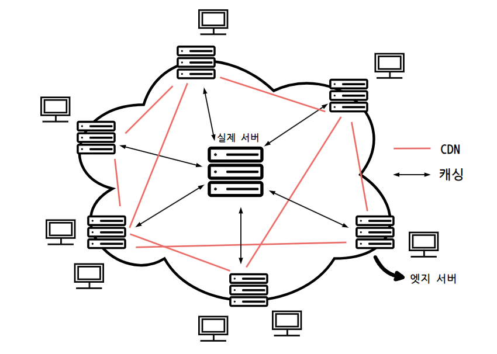

# CDN(Content Delivery Network)

물리적으로 떨어져 있는 사용자에게 컨텐츠를 더 빠르게 제공하기 위해 고안된 기술로 지리적으로 분산된 서버들을 연결한 네트워크

CDN은 여러 대의 서버로 구성되며, 지리적으로 다양한 위치에 분산되어 있다. 이 서버들은 실제 서버에서 웹 컨텐츠(HTML 파일, 이미지 등)를 가져와 자체적으로 캐싱하고 저장한다. 그리고 사용자가 웹 사이트나 애플리케이션의 컨텐츠에 접근하려 할 때, 가장 가까운 혹은 최적의 서버에서 해당 컨텐츠를 제공하도록 한다. 이런 이유로 CDN 서버를 엣지 서버라고도 한다.

#### 엣지 서버

* 사용자와 가까운 위치에서 데이터를 로컬로 처리하는 엣지 컴퓨팅 방식의 서버
* 사용자가 웹 애플리케이션과 같은 콘텐츠 및 리소스에 즉각적으로 접근할 수 있도록 한다.
* 대역폭을 절약하고 지연 시간을 줄여 사용자의 경험을 개선한다.

CDN 서버는 실제 서버보다 사용자와의 거리가 더 가깝다. 이렇게 컨텐츠와 사용자 간의 거리를 줄임으로써 여러 이점을 누리게 된다.

### CDN의 이점

* 대역폭 사용량 감축 : CDN이 사용자와 더 가까운 곳에 컨텐트의 복사본을 저장함으로써 원래 서버로부터의 데이터 전송량을 줄인다. 이를 통해 해당 기업의 대역폭 사용량 및 비용이 절약된다.

* 응답 소요시간 단축: 웹 컨텐츠를 요청하는 사용자와 이를 제공하는 서버 간의 거리가 길수록 소요시간이 늘어날 수 있다. CDN 서버는 사용자와 더 가까운 곳에 웹 컨텐츠를 저장하므로 소요시간을 단축시킬 수 있다.

* 트래픽 급증에 효과적으로 대응: 로드 밸런싱을 사용하여 트래픽을 여러 서버에 분산시킴으로써 하나의 서버에 과부하가 일어나는 것을 방지한다.

* 사용자 만족도 상승: 로딩 속도 저하, 미디어 재생 및 애플리케이션 응답 관련 문제 등은 사용자가 웹사이트를 이탈하거나 회피하는 주된 이유입니다. CDN을 사용하면 이러한 성능 문제 중 일부를 예방하거나 줄일 수 있으며, 그러면 컨텐츠 소비자가 사이트의 대화형 서비스에 만족할 가능성이 커집니다.

일반적으로 기업은 CDN 제공업체로부터 CDN 서비스를 구매하며, CDN 제공업체는 자체 서버 네트워크를 운영한다. 전체 웹 트래픽의 절반 이상이 CDN을 통해 서비스되는 중이며, 기업들이 글로벌 거점을 확대할수록 이 비율은 계속해서 증가할 것이다.

## CDN의 작동 방식

서버를 분산시켜 캐싱해두고, 사용자의 컨텐츠 요청이 들어오면 사용자와 가장 가까운 위치에 존재하는 서버로 매핑시킨다. 요청된 파일이 캐싱되어 있다면 캐싱된 파일로 요청을 처리하고, 캐싱되어 있지 않다면 CDN의 다른 서버에서 콘텐츠를 찾는다.

예를 들어 한국에서 미국 사이트에 접근할 경우, CDN은 미국에 있는 원래 서버가 아니라 한국에 있는 엣지 서버, 즉 사용자에게 더 가까운 서버에서 해당 웹 페이지를 서비스한다.

#### CDN이 필요한 경우

모든 서비스가 CDN이 필요한 것은 아니다. 만약 지역내 학군이나 해당 지역구의 웹사이트처럼 사용자 대부분이 지리적으로 가까운 곳에서 접근하는 경우 CDN이 필요하지 않을 수도 있다. 서비스 요청들이 지리적으로 분산되어 있거나, 빠르게 전달해야 할 중요한 컨텐츠가 있다면 CDN을 고려하는 것이 좋다.